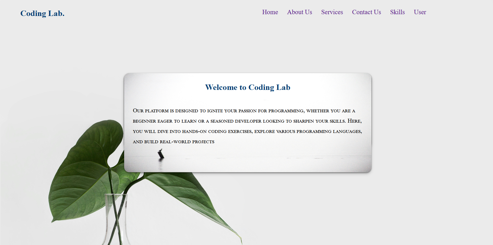
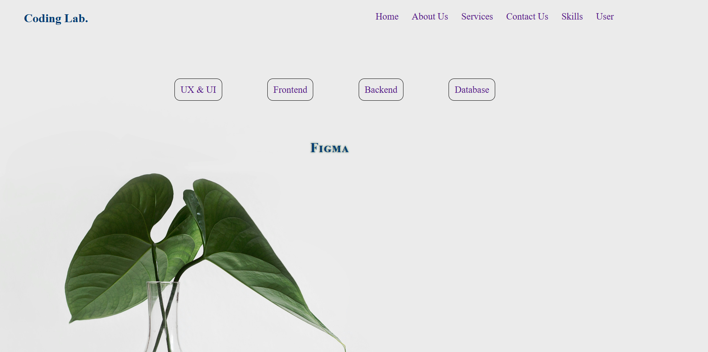
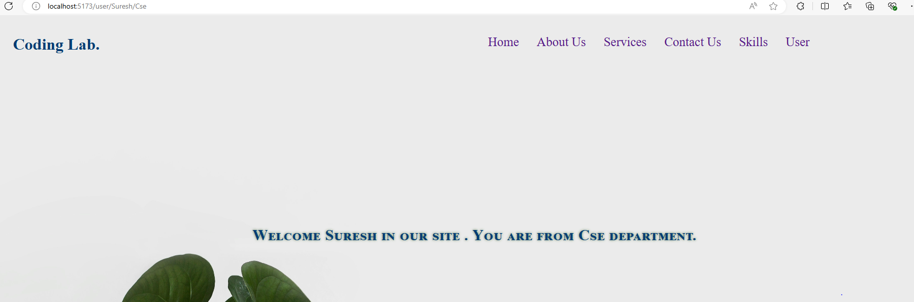

<h1 align ="center">REACT ROUTER</h1>
<!-- <h2><a href="https://hyperdevil-x.github.io/formvalidation/" target="_blank">Form Link</a></h2> -->

 <h3  align ="center"><b>Routing || Nested Routing || Passing Parameter Routing</b></h3>
  

In react router helps to redirect the pages from one to another without loading the browser.It works very felixible and in effcient way.

<ul>
 <li>Routing</li> 
   
 <li>Nested Routing</li> 
   
 <li>Passing Parameter Routing - using useParams Hook (that returns a dynamic parameter of the URL that the user is currently on)</li> 
   
 &nbsp;&nbsp;
-----This three routing have shown here.------

</ul>
<h2>To install router on your code editor terminal or in cmd - run this command</h2>
<h2>npm install react-router-dom --save</h2>
<ul>
 <h1><b>Programing Languages<b></h1>
<h2><b>Front-End</b></h2>
<li>HTML5</li>
 <li>CSS3</li>
  <li>React js</li>
</ul>
<ul>
<h2><b> Back-End </b></h2>
 <li>Node js</li>
</ul>

